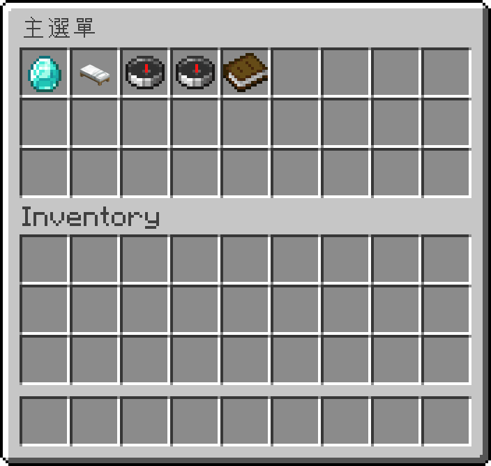
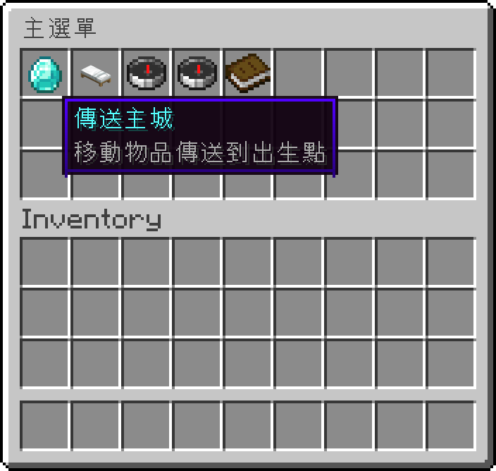

# Player Menu GUI

**English** | [繁體中文](README.zh-TW.md)

A chest-GUI quick menu opened with Shift + F (or `/menu`): teleport to spawn or home, browse the admin and player game worlds, create worlds through an anvil text box, WorldEdit tools for world editors, dice, and a complete Monopoly control panel.

> This repository has two editions of the same script: **繁體中文 (zh-TW)** is the original used on the author's Traditional Chinese server, and **English** is a full translation (commands, messages and variable names) with the same features.

<!-- BEGIN LIVE SCREENSHOTS -->

## Screenshots

*`/menu` as an ordinary player: the 3-row `主選單` chest GUI exactly as the server sent it (`generic_9x3`, 5 buttons).*

*The same menu with the first button hovered. Item name and lore are the real values from the `window_items` packet.*

> These are live-server captures, not native client screenshots. A headless client logged into a real Paper 26.2 server, triggered the script, and the block / UI data the server sent back was re-rendered using the official Minecraft 26.2 client assets. Mojang/Microsoft image assets are not covered by this repository's code licence.

<!-- END LIVE SCREENSHOTS -->

## Features

- Opens with sneak + swap hands (F) on Java, sneak + emote on Bedrock (needs a Geyser extension such as EmoteOffhand that turns emotes into an off-hand swap), or `/menu`
- Spawn / home teleports and one-click world browsers for game worlds and player worlds
- Context buttons: wooden axe, game-mode toggle, WorldEdit guide book and delete-world for editors inside their player world; delete-game-world for admins inside a game world
- Create worlds by typing the name into an anvil (skript-anvil-input-api)
- In-game guide books for player worlds and WorldEdit
- Monopoly panel inside `game_12`: dice, cash, ranking, GO, taxes, cards, pay a player, and bank tools for admins

## Requirements

- [Paper](https://papermc.io/) server (developed on Paper 26.2 / Minecraft 26.2)
- [Skript](https://github.com/SkriptLang/Skript) (developed on 2.16.2)
- [skript-reflect](https://github.com/SkriptLang/skript-reflect) (developed on 2.6.3)
- [skript-player-game-worlds](https://github.com/Im-Tim-mI/skript-player-game-worlds) - **required** (`pw_base()`, `canEdit()`)
- [skript-anvil-input-api](https://github.com/Im-Tim-mI/skript-anvil-input-api) - **required** (`openAnvilInput()`, `on anvil input`)
- [skript-game-world-manager](https://github.com/Im-Tim-mI/skript-game-world-manager), [skript-monopoly-helper](https://github.com/Im-Tim-mI/skript-monopoly-helper), [skript-dice-roller](https://github.com/Im-Tim-mI/skript-dice-roller) - the buttons run their commands
- [EssentialsX](https://essentialsx.net/) (`/spawn`, `/home`)
- [WorldEdit](https://enginehub.org/worldedit)

## Installation

1. Install the plugins listed under [Requirements](#requirements).
2. Download **one** edition:

   | Edition | File(s) |
   |---|---|
   | English | [`en/player-menu-gui.sk`](en/player-menu-gui.sk) |
   | 繁體中文 (original) | [`zh-TW/玩家選單GUI.sk`](zh-TW/%E7%8E%A9%E5%AE%B6%E9%81%B8%E5%96%AEGUI.sk) |

3. Copy the `.sk` file(s) into `plugins/Skript/scripts/` on your server.
4. Run `/sk reload player-menu-gui` (use the file name you copied) or restart the server.

> [!IMPORTANT]
> Install **only one** edition. Both editions are the same script in different languages - loading both makes them clash or run twice.

## Commands

| Command (English edition) | zh-TW edition | Description | Permission |
|---|---|---|---|
| `/menu` | `/menu`、`/選單` | Open the main menu | everyone |
| Shift + F (sneak + swap hands) | Shift + F（蹲下 + 切換副手） | Open the main menu | everyone |

## Configuration

- `isAdmin()` decides who sees admin buttons: OP or the permission `menu.admin`.
- The Monopoly button only appears in the world `game_12` - search for it to use another world.
- The guide books are signed by `rr901037`; change the `set book author` lines to your own name.

## Notes

- Use the same language edition for all related scripts: the menu runs their commands (`/pwlist`, `/gwlist`, `/dice1`, `/monopoly_roll`, …) and reads their variables.
- Menus are recognized by their titles (e.g. `Main Menu`), so avoid other plugins using the same inventory titles.
- The English edition's Monopoly buttons call the full `monopoly_` command names; the zh-TW edition calls the English aliases (`/roll`, `/pay`, …).

## Related projects

- [skript-player-game-worlds](https://github.com/Im-Tim-mI/skript-player-game-worlds) - Player Game Worlds
- [skript-anvil-input-api](https://github.com/Im-Tim-mI/skript-anvil-input-api) - Anvil Input API
- [skript-game-world-manager](https://github.com/Im-Tim-mI/skript-game-world-manager) - Game World Manager
- [skript-monopoly-helper](https://github.com/Im-Tim-mI/skript-monopoly-helper) - Monopoly Helper
- [skript-dice-roller](https://github.com/Im-Tim-mI/skript-dice-roller) - Dice Roller
- [skript-discord-link-reminder](https://github.com/Im-Tim-mI/skript-discord-link-reminder) - Discord Link Reminder

## License

**MIT + Commons Clause** - see [LICENSE](LICENSE) for the full text.

- ✅ You may use, copy, modify and share this script.
- ✅ You **may** install and run it - including modified versions - on Minecraft servers that charge money or are run for profit.
- ❌ You may **not** sell the script itself or modified versions of it, directly or indirectly, or require payment to obtain its files or source code.

Copyright (c) 2026 廷廷小教室、廷廷的家（Tim945）
